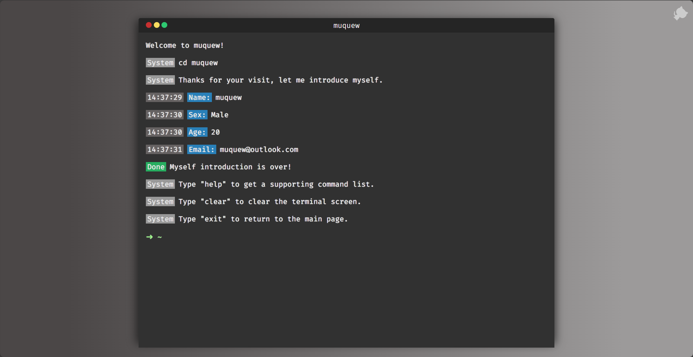
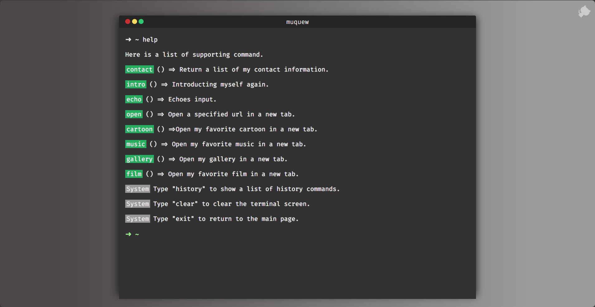

	<h1>Web-terminal</h1>
	Built with ❤︎ by <a href="http://www.muquew.com">muquew</a>

🚀 <strong>一个简洁&漂亮的终端模拟页面</strong>

## 👀目录

- [🎉简介](https://github.com/muquew/web-terminal/blob/master/README.zh_CN.md#简介)
- [✨开发](https://github.com/muquew/web-terminal/blob/master/README.zh_CN.md#开发)
- [💚赞赏](https://github.com/muquew/web-terminal/blob/master/README.zh_CN.md#赞赏)
- [📃支援](https://github.com/muquew/web-terminal/blob/master/README.zh_CN.md#支援)

## 🎉简介

[在线体验](http://www.muquew.com/about)

[`Web-terminal`](http://www.muquew.com/about) 是一款终端模拟页面

如果你正在找一款展示信息的交互式页面，那么 `Web-terminal` 会是你很好的选择。

`Web-terminal` 所支持的特性如下：

1. 内置系统命令：`ls`，`cd`，`pwd`，`echo`，`clear` 等
2. 可使用`tab`自动补全命令
3. 包括了光标位置显示，文本选中高光显示
4. 可使用方向键回到历史命令，并使用`hsitory`查询历史命令
5. 可自定义所有命令样式
6. 与 JS 结合，可任意模拟系统命令

## ✨开发

### 懒得说

## 📃支援

MIT License © Simon Ma	[Tomotoes/react-terminal: 🍳A terminal emulator in React. (github.com)](https://github.com/Tomotoes/react-terminal)

